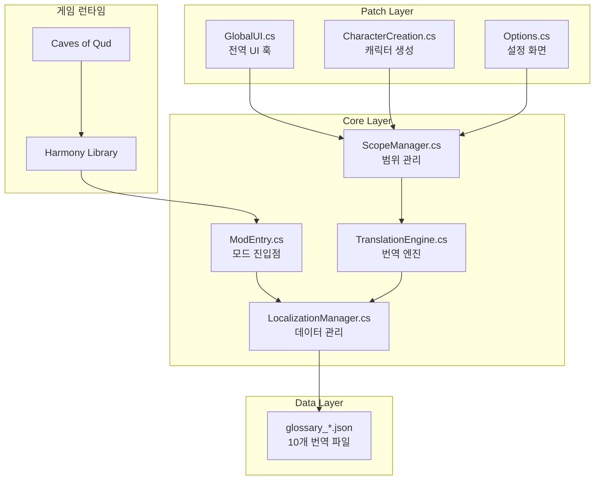

# Caves of Qud 한글화 프로젝트 - 종합 개발 가이드

> **문서 버전**: 3.2 | **최종 업데이트**: 2026-01-16

> [!IMPORTANT]
> **AI 에이전트**: 이 문서를 읽기 전에 반드시 `00_PRINCIPLES.md`를 먼저 읽으세요!
> ```bash
> cat Docs/00_PRINCIPLES.md  # 필수! 대원칙 문서
> ```

이 문서는 상세 개발 가이드입니다. 대원칙과 필수 규칙은 `00_PRINCIPLES.md`에 있습니다.

### 핵심 문서 4종
| 문서                        | 용도                           | 업데이트 주기 |
| --------------------------- | ------------------------------ | ------------- |
| **01_DEVELOPMENT_GUIDE.md** | 개발 참조 가이드 (이 문서)     | 구조 변경 시  |
| **02_TODO.md**              | 작업 추적 (할 일/진행 중/완료) | 작업 시마다   |
| **03_CHANGELOG.md**         | 완료된 작업 기록               | Phase 완료 시 |
| **04_ERROR_LOG.md**         | 에러/이슈 추적 및 해결 기록    | 이슈 발생 시  |

### 문서 연동 구조
```
01_DEVELOPMENT_GUIDE.md (참조 - 불변)
          ↓
02_TODO.md (동적 추적)
          ↓
03_CHANGELOG.md (완료 기록)
          ↓
04_ERROR_LOG.md (에러/이슈 기록)
```

---

# Part 0: 개발 대원칙 (Core Principles)

> [!IMPORTANT]
> **이 섹션은 모든 AI 에이전트와 개발자가 반드시 숙지해야 하는 대원칙입니다.**
> 모든 작업은 아래 원칙을 기반으로 수행되어야 합니다.

---

## 0.1 작업 철학 (Work Philosophy)

### 🎯 목표 지향적 작업
| 원칙             | 설명                             | 실천 방법                                     |
| ---------------- | -------------------------------- | --------------------------------------------- |
| **완전성 추구**  | 절반만 완료된 기능은 기능이 아님 | 하나의 작업을 완료하기 전 다른 작업 시작 금지 |
| **검증 후 진행** | 추측과 가정 배제                 | 실제 코드/데이터 확인 후 작업                 |
| **문서화 동반**  | 작업 완료 = 코드 + 문서          | 모든 변경사항은 관련 문서에 반영              |

### 🔄 반복적 개선
```
1. 조사 (Investigation) → 실제 상황 파악
     ↓
2. 계획 (Planning) → 구체적 실행 계획 수립
     ↓
3. 실행 (Execution) → 계획대로 구현
     ↓
4. 검증 (Verification) → 결과 확인 및 테스트
     ↓
5. 기록 (Documentation) → 완료 내용 문서화
```

---

## 0.2 문서화 문화 (Documentation Culture)

### 📝 문서화 우선 원칙

> **"문서에 없으면 존재하지 않는 것"**

| 상황                | 행동                            |
| ------------------- | ------------------------------- |
| 새로운 기능 구현 시 | 구현 완료 후 개발 가이드에 반영 |
| 버그 발견 시        | `04_ERROR_LOG.md`에 즉시 기록   |
| 작업 시작/완료 시   | `02_TODO.md` 상태 업데이트      |
| Phase 완료 시       | `03_CHANGELOG.md`에 정리        |

### 📋 상세 기록 원칙

**간략화 금지!** 문서는 다음 기준을 충족해야 합니다:

1. **처음 보는 사람이 이해 가능**: 맥락 없이도 파악 가능하도록 상세 기술
2. **AI 에이전트가 활용 가능**: 구체적 예시와 명령어 포함
3. **과거 내역 추적 가능**: 왜 그런 결정을 했는지 근거 기록
4. **미래 작업 안내 가능**: 다음 작업자가 무엇을 해야 하는지 명확

### 📊 문서 품질 기준

```markdown
❌ 나쁜 예시:
"인벤토리 번역 추가"

✅ 좋은 예시:
"인벤토리 화면(`02_10_07_Inventory.cs`) 패치:
- 대상: `InventoryAndEquipmentStatusScreen` 클래스
- 패치 메서드: `UpdateViewFromData()` (Postfix)
- 번역 항목: 15개 (glossary_ui.json inventory 카테고리)
- 미완성: FilterBar '*All' 필터 (컴포넌트 접근 방법 조사 필요)
- 테스트: 인벤토리 열기 → 카테고리 헤더 한글 확인"
```

---

## 0.3 AI 에이전트 협업 원칙 (AI Collaboration)

### 🤖 AI 에이전트 작업 규칙

AI 에이전트가 이 프로젝트에서 작업할 때 지켜야 할 원칙:

| 원칙                 | 상세 설명                                                 |
| -------------------- | --------------------------------------------------------- |
| **문서 우선 확인**   | 작업 전 `01_DEVELOPMENT_GUIDE.md`, `02_TODO.md` 필수 확인 |
| **추측 금지**        | 메서드 시그니처, 클래스 위치 등 반드시 검색으로 확인      |
| **기존 코드 재사용** | 새 유틸리티 생성 전 기존 메서드 검색                      |
| **에러 기록**        | 모든 에러/해결 과정을 `04_ERROR_LOG.md`에 기록            |
| **상태 업데이트**    | 작업 시작/완료 시 `02_TODO.md` 업데이트                   |

### 📌 컨텍스트 상실 시 복구 절차

AI 에이전트가 컨텍스트를 잃었을 때:

```bash
# 1. 현재 상태 파악
cat Docs/01_DEVELOPMENT_GUIDE.md   # 프로젝트 구조 이해
cat Docs/02_TODO.md                 # 진행 중인 작업 확인
cat Docs/04_ERROR_LOG.md            # 알려진 이슈 확인

# 2. 프로젝트 검증
python3 tools/project_tool.py       # 현재 상태 검증
```

### 🔍 조사 시 필수 확인 사항

새로운 화면/기능 작업 전 반드시:

```bash
# 1. 클래스 위치 (XRL.UI + Qud.UI 양쪽!)
grep -r "class TargetClass" Assets/core_source/

# 2. 메서드 시그니처 (정확히!)
grep -A 10 "void MethodName" Assets/core_source/Path/To/Class.cs

# 3. 텍스트 출처 (C# 하드코딩 vs XML)
grep -ri "번역할 텍스트" Assets/core_source/ Assets/StreamingAssets/Base/

# 4. 기존 패치 중복 확인
grep -r "클래스명\|기능명" Scripts/02_Patches/

# 5. 기존 용어집 확인
grep -r "키워드" LOCALIZATION/*.json
```

---

## 0.4 안전 규칙 (Safety Rules)

### ⚠️ 절대 금지 사항 (NEVER DO)

| 금지 사항                 | 이유                   | 올바른 방법                     |
| ------------------------- | ---------------------- | ------------------------------- |
| `_Legacy/` 폴더 코드 사용 | 더 이상 유효하지 않음  | 현재 `Scripts/` 폴더만 사용     |
| 메서드 시그니처 추측      | Harmony 패치 실패 원인 | `grep`으로 실제 시그니처 확인   |
| 검증 없이 배포            | 런타임 에러 발생       | `project_tool.py` 실행 후 배포  |
| 특수 태그 번역            | 게임 기능 파손         | `%placeholder%`, `{{tag}}` 유지 |
| 중복 로직 생성            | 코드 파편화            | 기존 메서드 재사용/확장         |
| XRL.UI만 확인             | 실제 Qud.UI 사용 가능  | 양쪽 네임스페이스 모두 확인     |

### ✅ 항상 해야 할 것 (ALWAYS DO)

```markdown
1. ☐ 작업 전 문서 확인 (01, 02, 04)
2. ☐ 기존 코드 검색 후 재사용 판단
3. ☐ 실제 소스 코드에서 시그니처 확인
4. ☐ 작업 완료 후 project_tool.py 검증
5. ☐ 게임 내 테스트로 동작 확인
6. ☐ 문서 업데이트 (TODO, ERROR_LOG 등)
7. ☐ 커밋 메시지에 변경 내용 상세 기록
```

### 🛡️ 방어적 코딩

```csharp
// ✅ 좋은 예: null 체크, 안전한 접근
var dict = LocalizationManager.GetCategory("ui");
if (dict != null && dict.TryGetValue(key, out var value))
{
    return value;
}
return fallback;

// ❌ 나쁜 예: 직접 접근
return LocalizationManager.GetCategory("ui")[key]; // NullReferenceException 위험!
```

---

## 0.5 코드 기반 작업 원칙 (Code-First)

### 🔬 실제 코드 기반 작업

> **"추측은 버그의 시작"**

| 단계           | 설명               | 예시                                   |
| -------------- | ------------------ | -------------------------------------- |
| 1. 조사        | 실제 소스에서 확인 | `grep "void Show" Assets/core_source/` |
| 2. 근거 제시   | 파일:라인 명시     | `OptionsScreen.cs:127`                 |
| 3. 명시적 패치 | 타입 명시          | `new Type[] { typeof(string) }`        |
| 4. 검증        | 자동화 도구 활용   | `project_tool.py`                      |

### 📐 명시적 코드 작성

```csharp
// ❌ 암시적 (런타임에 문제 발생 가능)
[HarmonyPatch(typeof(Options), "Show")]

// ✅ 명시적 (컴파일 타임에 검증 가능)
[HarmonyPatch(typeof(Options), nameof(Options.Show), new Type[] { })]
```

---

## 0.6 품질 기준 (Quality Standards)

### 📊 완료 기준 체크리스트

작업이 "완료"로 간주되려면:

```markdown
코드 품질:
- [ ] project_tool.py 검증 통과
- [ ] 기존 기능 정상 동작 유지
- [ ] 스코프 Push/Pop 균형 확인
- [ ] 예외 처리 완료

문서화:
- [ ] 02_TODO.md 상태 업데이트
- [ ] 에러 발생 시 04_ERROR_LOG.md 기록
- [ ] 필요 시 개발 가이드 업데이트

테스트:
- [ ] 게임 내 번역 표시 확인
- [ ] 관련 기능 정상 동작 확인
- [ ] 로그에 에러 없음 확인
```

### 🎯 번역 품질 기준

| 기준           | 설명                  |
| -------------- | --------------------- |
| **일관성**     | 동일 용어 = 동일 번역 |
| **완전성**     | 빈 값, 누락 없음      |
| **자연스러움** | 한국어 문법 준수      |
| **정확성**     | 원문 의미 정확 전달   |

---

## 0.7 커뮤니케이션 원칙 (Communication)

### 💬 명확한 기록

모든 결정과 변경에는 **이유**를 기록:

```markdown
❌ 나쁜 예:
"Options 패치 수정"

✅ 좋은 예:
"Options 패치를 데이터 레이어 + UI 레이어 이중 패치로 변경
- 이유: 단일 패치로는 동적 로드 옵션 번역 불가
- 변경: LoadOptionNode (데이터) + OptionsScreen.Show (UI)
- 결과: 모든 옵션 한글 표시 확인"
```

### 📢 이슈 보고 형식

```markdown
## 이슈 요약
[간결한 한 줄 설명]

## 상세 증상
[에러 메시지, 스크린샷, 재현 방법]

## 원인 분석
[왜 발생했는지 분석]

## 시도한 해결
1. [방법 1] → [결과]
2. [방법 2] → [결과]

## 해결/다음 단계
[성공한 방법 또는 다음 시도 계획]
```

---

## 0.8 원칙 요약

```
┌─────────────────────────────────────────────────────────────┐
│                     개발 대원칙 요약                          │
├─────────────────────────────────────────────────────────────┤
│ 1. 문서 우선: 문서에 없으면 존재하지 않는 것                    │
│ 2. 추측 금지: 반드시 실제 코드에서 확인                        │
│ 3. 재사용 우선: 새 코드 전에 기존 코드 검색                    │
│ 4. 검증 필수: project_tool.py 없이 배포 금지                  │
│ 5. 에러 기록: 모든 이슈는 ERROR_LOG에 남김                    │
│ 6. 완전성 추구: 중간 상태로 두지 않음                         │
│ 7. 상세 기록: AI도 이해할 수 있게 구체적으로                   │
└─────────────────────────────────────────────────────────────┘
```

---

# Part A: 빠른 시작 (Quick Start)

## A.1 작업 시작 전 필수 실행 (1분)

```bash
# 1. 문서 인덱스 및 시그니처 확인
cat Docs/01_DEVELOPMENT_GUIDE.md

# 2. 현재 TODO 상태 확인
cat Docs/02_TODO.md

# 3. 통합 검증 및 상태 확인
python3 tools/project_tool.py
```

## A.2 핵심 명령어 (복사해서 사용)

```bash
# 클래스 위치 찾기
grep -r "class ClassName" Assets/core_source/

# 메서드 시그니처 확인
grep -A 5 "public void MethodName" Assets/core_source/_GameSource/XRL.UI/FileName.cs

# 텍스트 출처 확인 (C# + XML 동시 검색)
grep -ri "exact text" Assets/core_source/ Assets/StreamingAssets/Base/

# 프로젝트 검증
python3 tools/project_tool.py

# 모드 배포
./tools/sync-and-deploy.sh
```

## A.3 핵심 파일 경로

| 용도         | 경로                                           |
| ------------ | ---------------------------------------------- |
| 번역 엔진    | `Scripts/00_Core/00_01_TranslationEngine.cs`   |
| 데이터 관리  | `Scripts/00_Core/00_03_LocalizationManager.cs` |
| 전역 UI 패치 | `Scripts/02_Patches/UI/02_10_00_GlobalUI.cs`   |
| 공통 UI 용어 | `LOCALIZATION/glossary_ui.json`                |

## A.4 핵심 규칙 (암기!)

### ✅ 항상 해야 할 것
```
1. 이 문서 + 02_TODO.md 먼저 확인
2. 기존 메서드 재사용
3. project_tool.py 실행 후 배포
4. 에러 발생 시 04_ERROR_LOG.md에 기록
```

### ❌ 절대 금지
```
1. _Legacy/ 폴더 코드 사용
2. TranslationEngine 로직 중복
3. 검증 없이 배포
4. 메서드 시그니처 추측
```

---

# Part B: 프로젝트 인덱스 (Project Index)

## B.1 코어 스크립트 구조

### 📂 Core (8개 파일)

| 파일                           | 역할           | 주요 메서드                      |
| ------------------------------ | -------------- | -------------------------------- |
| `00_00_ModEntry.cs`            | 모드 진입점    | `Main()`                         |
| `00_01_TranslationEngine.cs`   | 번역 핵심 로직 | `TryTranslate()`                 |
| `00_02_ScopeManager.cs`        | 범위 관리      | `PushScope()`, `PopScope()`      |
| `00_03_LocalizationManager.cs` | 데이터 관리    | `Initialize()`, `GetTerm()`      |
| `00_04_GlossaryLoader.cs`      | 용어집 로드    | `LoadGlossary()`                 |
| `00_05_GlossaryExtensions.cs`  | 문자열 보간    | `G()` 확장 메서드                |
| `00_06_G.cs`                   | 간편 접근자    | `G._()`                          |
| `00_99_QudKREngine.cs`         | 한국어 처리    | `HasJongsung()`, `ResolveJosa()` |

### 📂 Patches (11개 파일)

| 파일                            | 대상          | 역할                      |
| ------------------------------- | ------------- | ------------------------- |
| `02_00_01_SteamGalaxy.cs`       | Steam/Galaxy  | 플랫폼 초기화             |
| `02_00_02_ScreenBuffer.cs`      | ScreenBuffer  | 화면 버퍼 텍스트          |
| `02_10_00_GlobalUI.cs`          | 전역 UI       | 메인 메뉴, 팝업, TMP_Text |
| `02_10_01_Options.cs`           | 옵션 화면     | 설정 메뉴                 |
| `02_10_02_Tooltip.cs`           | 툴팁          | ModelShark 툴팁           |
| `02_10_03_UITextSkin.cs`        | UITextSkin    | TMPro UI 텍스트           |
| `02_10_04_ListScroller.cs`      | ListScroller  | 스크롤 리스트             |
| `02_10_07_Inventory.cs`         | 인벤토리      | 인벤토리 화면             |
| `02_10_08_Status.cs`            | 상태창        | 캐릭터 상태               |
| `02_10_10_CharacterCreation.cs` | 캐릭터 생성   | 12개 모듈 전체            |
| `02_10_15_EmbarkOverlay.cs`     | 출발 오버레이 | Back/Next 버튼            |

### 📂 Utils (2개 파일)

| 파일                               | 역할             | 주요 메서드                    |
| ---------------------------------- | ---------------- | ------------------------------ |
| `99_01_TranslationUtils.cs`        | 태그 보존 번역   | `TryTranslatePreservingTags()` |
| `99_02_ChargenTranslationUtils.cs` | 캐릭터 생성 유틸 | `TranslateLongDescription()`   |

## B.2 용어집 현황

| 파일                        | 항목 수 | 완성도 | 용도          |
| --------------------------- | ------- | ------ | ------------- |
| `glossary_ui.json`          | ~170    | 100%   | 공통 UI       |
| `glossary_chargen.json`     | ~130    | 100%   | 캐릭터 생성   |
| `glossary_skills.json`      | ~280    | 100%   | 스킬          |
| `glossary_mutations.json`   | ~150    | 96.5%  | 변이          |
| `glossary_cybernetics.json` | ~190    | 100%   | 사이버네틱스  |
| `glossary_options.json`     | ~800    | 94%    | 설정 화면     |
| `glossary_pregen.json`      | ~50     | 100%   | 프리셋 캐릭터 |
| `glossary_proto.json`       | ~60     | 100%   | 종족/유형     |
| `glossary_location.json`    | ~50     | 100%   | 시작 위치     |
| `glossary_terms.json`       | ~35     | 100%   | 일반 용어     |

---

# Part C: API 및 네임스페이스 참조

## C.1 UI 핵심 시스템

### ScreenBuffer [ConsoleLib.Console]
**용도:** 전역 텍스트 렌더링 시스템

| 메서드                   | 시그니처                                                                                                        |
| ------------------------ | --------------------------------------------------------------------------------------------------------------- |
| `Write`                  | `void Write(string s, bool processMarkup, bool HFlip, bool VFlip, List<string> imposters, int maxCharsWritten)` |
| `WriteBlockWithNewlines` | `void WriteBlockWithNewlines(string text, int x, int y, bool center)`                                           |

### Popup [XRL.UI]
**용도:** 모든 알림 및 선택 팝업

| 메서드             | 시그니처                                                           |
| ------------------ | ------------------------------------------------------------------ |
| `Show`             | `static void Show(string Text, bool CopyToHistory, bool bQuiet)`   |
| `ShowOptionPicker` | `static int ShowOptionPicker(string Title, string[] Options, ...)` |

### UITextSkin [XRL.UI]
**용도:** 모던 UI 텍스트 관리

| 메서드  | 시그니처                                          |
| ------- | ------------------------------------------------- |
| `Apply` | `void Apply()` - `__instance.text` 값을 직접 수정 |

## C.2 주요 화면 클래스 네임스페이스

### Qud.UI (신규 UI)
```csharp
using Qud.UI;

- MainMenuScreen           // 메인 메뉴 창
- MainMenu                 // 메인 메뉴 창
- TradeScreen              // 거래 화면
- CharacterStatusScreen    // 캐릭터 상태
- StatusScreensScreen      // 모던 통합 상태창
- SkillsAndPowersStatusScreen // 스킬 및 권능 탭
- QuestsStatusScreen       // 퀘스트 탭
- FactionsStatusScreen     // 평판 탭
- JournalStatusScreen      // 일지 탭
- TinkeringStatusScreen    // 팅커링 탭
- MessageLogStatusScreen   // 메시지 로그 탭
- OptionsScreen            // 옵션 화면
- PlayerStatusBar          // 상단 HUD 상태바
- InventoryAndEquipmentStatusScreen // 인벤토리
```

### XRL.UI (레거시/공통 UI)
```csharp
using XRL.UI;

- Popup                    // 알림/선택 팝업
- InventoryScreen          // 인벤토리 화면
- StatusScreen             // 클래식 상태창
- CyberneticsScreen        // 모던 사이버네틱스 화면
- TinkeringScreen          // 모던 팅커링 화면
- EquipmentScreen          // 모던 장비 화면
- UITextSkin               // 텍스트 렌더링 스킨
- Look                     // 살펴보기(Look) UI
- ConversationUI           // 대화 UI
```

### ConsoleLib.Console
```csharp
using ConsoleLib.Console;

- ScreenBuffer             // ⚠️ 전역 텍스트 패치용
- TextConsole              // 콘솔 제어
```

## C.3 자주 발생하는 네임스페이스 실수

### ❌ 잘못된 예
```csharp
using XRL.UI;  // 틀림!
[HarmonyPatch(typeof(ScreenBuffer))]
```

### ✅ 올바른 예
```csharp
using ConsoleLib.Console;  // 맞음!
[HarmonyPatch(typeof(ScreenBuffer))]
```

### 클래스 찾기 명령어
```bash
# 특정 클래스의 네임스페이스 확인
grep -B 5 "class ClassName" Assets/core_source/_GameSource/*/ClassName.cs
```

---

# Part D: 개발 프로세스

## D.1 오류 방지 프로세스

### 1단계: 메서드 확인 (Source Inspection)
새로운 패치를 작성하기 전, 반드시 게임 소스 코드에서 **정확한 시그니처** 확인
```bash
grep "void MethodName(" Assets/core_source/Path/To/Class.cs
```

### 2단계: 패치 작성 (Implementation)
확인된 시그니처를 `HarmonyPatch` 어트리뷰트에 명시
```csharp
[HarmonyPatch("MethodName", new System.Type[] { typeof(Arg1Type), typeof(Arg2Type) })]
```

### 3단계: 자동 검증 (Validation)
```bash
python3 tools/project_tool.py
```
검증 항목:
- ✅ 클래스 파일 존재 여부 및 네임스페이스 일치
- ✅ 메서드 이름 존재 여부
- ✅ 파라미터 개수 및 시그니처 일치 여부
- ✅ 중괄호 및 세미콜론 등 기본 문법

### 4단계: 통합 배포 (Unified Deployment)
```bash
./tools/sync-and-deploy.sh "커밋 메시지"
```
*주의: 검증 단계에서 에러(`✗`)가 발생하면 배포와 Git 푸시가 자동 차단*

## D.2 코딩 규칙

### 네임스페이스
- 모든 패치 파일: `QudKRTranslation.Patches`
- 모든 데이터 파일: `QudKRTranslation.Data`

### Scope 관리
- 전역 패치(`ScreenBuffer`, `UITextSkin`): `ScopeManager.GetCurrentScope()` 확인
- 화면 패치: `Show_Prefix`에서 `PushScope`, `Postfix`에서 `PopScope`

### 표준 헤더
모든 C# 파일 최상단에 포함 (project_tool.py가 인덱스 갱신에 사용):
```csharp
/*
 * 파일명: [파일명].cs
 * 분류: [분류명 (예: Core, UI Patch)]
 * 역할: [이 파일이 하는 구체적인 일]
 */
```

## D.3 핵심 개발 원칙

| 원칙                    | 설명                                          |
| ----------------------- | --------------------------------------------- |
| **실제 코드 기반 작업** | 추측 금지! `Assets/core_source`에서 직접 확인 |
| **명시적 코드 작성**    | `nameof()` 사용, 파라미터 타입 명시           |
| **모듈화 및 안전성**    | 원본 게임 로직 보존, 방어적 코딩              |

## D.4 역할 분담 원칙

| 영역        | 담당                                                                |
| ----------- | ------------------------------------------------------------------- |
| **Core**    | 데이터 로드 및 최하단 엔진 (LocalizationManager, TranslationEngine) |
| **Utils**   | 공통 변환 로직 (TranslationUtils, JosaHandler)                      |
| **Patches** | 실제 게임 메서드 연결 (UI, World Patches)                           |
| **Data**    | 정적 데이터 정의 (OptionsData)                                      |

---

# Part E: 도구 가이드 (Tools Guide)

## E.1 핵심 도구

### project_tool.py ⭐⭐⭐
**용도**: 프로젝트 품질 검증 및 문서 자동 생성

```bash
python3 tools/project_tool.py
```

**기능:**
- 코드 구문 오류, 중복 함수, JSON 무결성 체크
- `project_metadata.json` 업데이트
- 중복 키/빈 값 탐지

### check_missing_translations.py ⭐⭐
**용도**: XML/C# 내 미번역 전수 조사

```bash
python3 tools/check_missing_translations.py
```

### check_logs_for_untranslated.py
**용도**: 게임 플레이 로그에서 미번역 텍스트 추출

```bash
python3 tools/check_logs_for_untranslated.py
```

## E.2 전체 도구 목록

| 파일                             | 유형   | 용도                    |
| -------------------------------- | ------ | ----------------------- |
| `project_tool.py`                | Python | 통합 검증 및 메타데이터 |
| `check_missing_translations.py`  | Python | XML/C# 미번역 탐색      |
| `check_logs_for_untranslated.py` | Python | 로그 미번역 추출        |
| `fix_json_duplicates.py`         | Python | JSON 중복 키 수정       |
| `merge_options.py`               | Python | 옵션 XML 병합           |
| `sort_json.py`                   | Python | JSON 정렬               |
| `deploy-mods.sh`                 | Shell  | 게임 폴더 배포          |
| `sync-and-deploy.sh`             | Shell  | 동기화 + 배포           |
| `validate-mod.sh`                | Shell  | 모드 무결성 검증        |

## E.3 도구 관리 원칙

1. **중복 금지**: 기존 도구 확장 우선
2. **경로 일반화**: 절대 경로 금지, `Path(__file__)` 활용
3. **결과물 동기화**: `project_tool.py` 실행 시 문서 자동 갱신

---

# Part F: 번역 워크플로우

## F.1 작업 흐름

```
1. Issues/TODO 확인 → 작업 선택
       ↓
2. 브랜치 생성: git checkout -b translate/[작업명]
       ↓
3. 파일 수정: LOCALIZATION/*.json 또는 Scripts/*.cs
       ↓
4. 검증: python3 tools/project_tool.py
       ↓
5. 게임 테스트: ./tools/deploy-mods.sh
       ↓
6. 커밋 및 PR
```

## F.2 파일 위치

| 번역 대상        | 파일 위치                                                      |
| ---------------- | -------------------------------------------------------------- |
| UI 및 공통 용어  | `LOCALIZATION/glossary_ui.json`, `glossary_options.json` 등    |
| 스킬 및 돌연변이 | `LOCALIZATION/glossary_skills.json`, `glossary_mutations.json` |
| 대화 및 퀘스트   | `Assets/StreamingAssets/Base/Conversations.xml`, `Quests.xml`  |

## F.3 번역 우선순위

### Tier 1 (최우선)
- 메인 메뉴, 캐릭터 생성, 인벤토리 UI, 기본 메시지

### Tier 2 (중요)
- 대화 시스템, 퀘스트 텍스트, 아이템 설명, 스킬/능력 설명

### Tier 3 (추가)
- 책 내용, 역사 텍스트, 고급 UI

## F.4 커밋 메시지 규칙

| 접두어   | 용도               |
| -------- | ------------------ |
| `feat:`  | 새로운 번역 추가   |
| `fix:`   | 번역 오류 수정     |
| `docs:`  | 문서 업데이트      |
| `style:` | 스타일 가이드 적용 |

---

# Part G: 용어집 시스템

## G.1 JSON 용어집 구조

```json
// glossary_ui.json 예시
{
  "ui": {
    "newGame": "새 게임",
    "continue": "계속하기",
    "options": "옵션"
  }
}
```

## G.2 사용 방법

### XML에서 사용
```xml
<!-- 단순 사용 -->
<text>[[phrase.greeting]]</text>

<!-- 조사와 함께 -->
<text>[[item.water]]{을/를} 마셨습니다</text>

<!-- 색상 태그와 혼합 -->
<text>{{color|cyan|[[faction.crystalism]]}}</text>
```

### C# 코드에서 사용
```csharp
using QudKRTranslation.Core;

// G 클래스 사용 (가장 간편)
string text = G._("ui.newGame");

// LocalizationManager 직접 사용
string term = LocalizationManager.GetTerm("ui", "newGame", "새 게임");
```

## G.3 용어 변경 방법

**JSON 파일만 수정하면 게임 재시작 시 자동 적용됩니다!**

```json
// 변경 전
{"item": {"milk": "우유"}}

// 변경 후
{"item": {"milk": "생수"}}
```

## G.4 주의사항

1. **JSON 구문**: 큰따옴표(`"`) 사용, 마지막 항목 뒤 쉼표 제거
2. **키명**: 영문 소문자, camelCase 사용
3. **플레이스홀더**: `[[category.key]]` 형식
4. **게임 명령어**: `{{ }}`, `=...=` 는 건드리지 마세요

---

# Part H: 스타일 가이드

## H.1 기본 원칙

| 원칙           | 설명                                    |
| -------------- | --------------------------------------- |
| **일관성**     | 동일 용어는 항상 동일 번역, 용어집 준수 |
| **명확성**     | 게임 정보 명확 전달, 모호한 표현 지양   |
| **자연스러움** | 한국어 문법 준수, 직역보다 의역         |

## H.2 존댓말 vs 반말

| 상황              | 문체   | 예시                                         |
| ----------------- | ------ | -------------------------------------------- |
| UI 텍스트         | 존댓말 | "게임을 저장하시겠습니까?"                   |
| 예의바른 NPC      | 존댓말 | "어서 오십시오, 여행자님."                   |
| 친근한/적대적 NPC | 반말   | "뭐 필요한 거 있어?"                         |
| 설명 텍스트       | 평서체 | "고대의 유물. 알 수 없는 에너지가 느껴진다." |

## H.3 조사 처리

### 플레이스홀더 사용
```
{{item}}{을/를} 획득했습니다.
{{npc}}{이/가} 말했다.
{{place}}{으로/로} 이동합니다.
```

### 조사 목록
| 조사        | 용도        |
| ----------- | ----------- |
| `{이/가}`   | 주격 조사   |
| `{을/를}`   | 목적격 조사 |
| `{은/는}`   | 보조사      |
| `{와/과}`   | 접속 조사   |
| `{으로/로}` | 부사격 조사 |
| `{이다/다}` | 서술격 조사 |

## H.4 길이 제약

| 영역      | 최대 길이 |
| --------- | --------- |
| UI 버튼   | 10자      |
| 메뉴 항목 | 15자      |
| 툴팁      | 50자      |

## H.5 피해야 할 표현

```
❌ "당신은 레벨 업 했습니다"
✅ "레벨이 올랐습니다"

❌ "아이템을 획득하셨습니다"
✅ "아이템을 획득했습니다"

❌ "HP가 full입니다"
✅ "HP가 가득 찼습니다"
```

## H.6 태그 및 변수 처리

### 색상 태그 (XML Markup)
- `{{color_char|text}}` 형식 유지
- ✅ `{{w|검정}}`, `{{y|금색}}` 처럼 텍스트 부분만 번역

### 스마트 변수
- `=player.name=`, `{{$name}}` 같은 변수는 **절대 번역하지 않음**
- 변수 뒤에 조사: `=item.name={{item}}{을/를}`

---

# Part I: QA 체크리스트

## I.1 QA 프로세스

### 1단계: 기술적 검증 (Technical QA)
```bash
# 통합 도구 실행
python3 tools/project_tool.py

# 로그 기반 미번역 탐색
python3 tools/check_logs_for_untranslated.py
```

### 2단계: 언어적 검증 (Linguistic QA)
- [ ] 용어 일관성 확인
- [ ] 조사 처리 자연스러움 확인
- [ ] 문체 일관성 확인

### 3단계: 인게임 검증 (In-Game QA)
```bash
# 모드 배포
./tools/deploy-mods.sh

# 로그 실시간 확인
tail -f ~/Library/Logs/Freehold\ Games/CavesOfQud/Player.log
```

## I.2 기능 테스트 체크리스트

### 모드 로딩
- [ ] 모드가 Mods 메뉴에 표시됨
- [ ] 모드 활성화 시 오류 없음
- [ ] 게임 재시작 후 정상 작동

### UI 번역
- [ ] 메인 메뉴: "New Game" → "새 게임"
- [ ] 캐릭터 생성: Genotype, Calling 설명 한글
- [ ] 인벤토리: 카테고리, 아이템 설명 한글
- [ ] 옵션 메뉴: 모든 설정 항목 한글

### 조사 처리
- [ ] "이/가" 자동 변환 정상
- [ ] "을/를" 자동 변환 정상
- [ ] "은/는" 자동 변환 정상
- [ ] 받침 판별 정확 (ㄹ 포함)

## I.3 Wish 명령어 (게임 내 테스트)

게임 내에서 `Enter` → `wish` 입력 후:
- `item:[아이템명]`: 아이템 소환
- `goto:[지역명]`: 지역 이동
- `stat:Experience:10000`: 레벨업 테스트

---

# Part J: 아키텍처

## J.1 시스템 구조도



## J.2 번역 파이프라인

```
원본 텍스트
    ↓
Trim (공백 제거)
    ↓
접두사 추출 (체크박스 등) → 보관
    ↓
색상 태그 제거 (Qud + Unity) → 보관
    ↓
사전 검색 (대소문자 변형: 원본→UPPER→Title→lower)
    ↓
태그 복원
    ↓
접두사 복원
    ↓
번역된 텍스트
```

## J.3 스코프 스택 구조

```
[현재: 팝업 메뉴] → [이전: 캐릭터 생성] → [베이스: 메인 메뉴]
```

- 화면 진입 시 `PushScope()`
- 화면 종료 시 `PopScope()`
- 번역 시 현재 스택에서 우선 검색

## J.4 프로젝트 폴더 구조

```
qud_korean/
├── Scripts/              # C# 모드 코드 (21개 파일)
│   ├── 00_Core/          # 핵심 엔진 (8개)
│   ├── 02_Patches/       # Harmony 패치 (11개)
│   └── 99_Utils/         # 유틸리티 (2개)
├── LOCALIZATION/         # 번역 데이터 (10개 JSON, ~1,500항목)
├── Assets/               # 게임 에셋 참조
│   ├── core_source/      # 디컴파일 소스
│   └── StreamingAssets/  # 게임 XML
├── tools/                # 개발 도구 (14개)
└── Docs/                 # 가이드 문서 (4개)
```

---

# Part K: 화면-에셋 맵핑

## K.1 주요 화면별 소스 위치

| 게임 화면       | XRL.UI 클래스               | Qud.UI 클래스                          | XML 데이터                           | 복잡도 |
| --------------- | --------------------------- | -------------------------------------- | ------------------------------------ | ------ |
| **메인 메뉴**   | -                           | `MainMenu.cs`                          | -                                    | 🟢 낮음 |
| **캐릭터 생성** | -                           | `XRL.CharacterBuilds.Qud.UI/*`         | `EmbarkModules.xml`, `Genotypes.xml` | 🔴 높음 |
| **인벤토리**    | `InventoryScreen.cs` (20KB) | `InventoryAndEquipmentStatusScreen.cs` | `ObjectBlueprints/`                  | 🔴 높음 |
| **설정**        | `Options.cs` (37KB)         | `OptionsScreen.cs`                     | `Options.xml`                        | 🟡 중간 |
| **거래**        | `TradeUI.cs` (52KB)         | `TradeScreen.cs`                       | -                                    | 🔴 높음 |
| **대화**        | `ConversationUI.cs` (15KB)  | -                                      | `Conversations.xml` (647KB)          | 🔴 높음 |
| **팝업**        | `Popup.cs` (82KB)           | `PopupMessage.cs`                      | -                                    | 🔴 높음 |
| **스킬**        | `SkillsAndPowersScreen.cs`  | `SkillsAndPowersStatusScreen.cs`       | `Skills.xml`                         | 🟡 중간 |
| **상태창**      | `StatusScreen.cs` (23KB)    | `CharacterStatusScreen.cs`             | -                                    | 🟡 중간 |

> [!CAUTION]
> **이중 구현 주의**: 대부분의 화면이 XRL.UI와 Qud.UI 양쪽에 존재. 실제 사용되는 클래스 확인 필수!

## K.2 XML 파일별 번역 대상

| XML 파일                 | 크기  | 주요 속성                           |
| ------------------------ | ----- | ----------------------------------- |
| `Conversations.xml`      | 647KB | `Text`, `Speaker`, `Choice`         |
| `Skills.xml`             | 53KB  | `Name`, `Description`, `Category`   |
| `Mutations.xml`          | 17KB  | `Name`, `Description`               |
| `Options.xml`            | 37KB  | `DisplayText`, `HelpText`, `Values` |
| `ObjectBlueprints/*.xml` | ~5MB  | `DisplayName`, `Description`        |

---

# Part L: AI 에이전트 가이드

## L.1 새 화면 번역 표준 절차

### Step 1: 조사 (Investigation)
```bash
# 1. 클래스 위치 확인 (XRL.UI + Qud.UI 양쪽)
grep -r "class ScreenName" Assets/core_source/

# 2. 메서드 시그니처 확인
grep -A 5 "public void Show" Assets/core_source/_GameSource/*/ScreenName.cs

# 3. 텍스트 출처 확인
grep -ri "버튼 텍스트" Assets/core_source/ Assets/StreamingAssets/Base/

# 4. 기존 패치 확인
grep -r "ScreenName" Scripts/02_Patches/
```

### Step 2: 패치 코드 템플릿
```csharp
/*
 * 파일명: 02_10_XX_NewScreen.cs
 * 분류: [UI Patch] 새 화면 번역
 * 역할: {화면명} UI 텍스트 번역
 */

using HarmonyLib;
using QudKRTranslation.Core;

namespace QudKRTranslation.Patches
{
    [HarmonyPatch(typeof(TargetClass))]
    public static class Patch_NewScreen
    {
        private static bool _scopePushed = false;

        [HarmonyPatch(nameof(TargetClass.Show))]
        [HarmonyPrefix]
        static void Show_Prefix()
        {
            if (!_scopePushed)
            {
                var dict = LocalizationManager.GetCategory("category_name");
                if (dict != null)
                {
                    ScopeManager.PushScope(dict);
                    _scopePushed = true;
                }
            }
        }

        [HarmonyPatch(nameof(TargetClass.Hide))]
        [HarmonyPostfix]
        static void Hide_Postfix()
        {
            if (_scopePushed)
            {
                ScopeManager.PopScope();
                _scopePushed = false;
            }
        }
    }
}
```

### Step 3: 검증
```bash
python3 tools/project_tool.py
./tools/sync-and-deploy.sh
tail -f ~/Library/Logs/Caves\ of\ Qud/Player.log | grep "Qud-KR"
```

## L.2 절대 하지 말아야 할 것

| ❌ 금지           | ✅ 올바른 방법                         |
| ---------------- | ----------------------------------     |
| 메서드 이름 추측 | `grep` 명령으로 실제 시그니처 확인     |
| XRL.UI만 확인    | XRL.UI + Qud.UI 양쪽 검색              |
| 텍스트 출처 가정 | C#/XML 전역 검색으로 확인              |
| 기존 코드 무시   | `project_tool.py`로 중복 확인          |
| 특수 태그 번역   | `%creature%`, `{{hotkey| ...}}` 유지.  |

## L.3 흔한 실수 패턴

### 실수 1: 존재하지 않는 메서드 패치
```csharp
// ❌ 잘못됨
[HarmonyPatch(typeof(InventoryScreen), "UpdateDisplay")]

// ✅ 먼저 확인
grep "void Update\|void Refresh\|void Show" Assets/core_source/_GameSource/XRL.UI/InventoryScreen.cs
```

### 실수 2: 잘못된 네임스페이스 패치
```csharp
// ❌ 잘못됨
[HarmonyPatch(typeof(XRL.UI.Options), "Show")]

// ✅ 양쪽 확인
ls Assets/core_source/_GameSource/XRL.UI/ | grep -i options
ls Assets/core_source/_GameSource/Qud.UI/ | grep -i options
```

### 실수 3: 특수 태그 깨뜨림
```json
// ❌ 잘못됨 - 플레이스홀더 번역함
{"{{W|&Y%creature%&W}} attacks you!": "{{W|&Y적&W}}이 당신을 공격합니다!"}

// ✅ 올바름 - 플레이스홀더 유지
{"{{W|&Y%creature%&W}} attacks you!": "{{W|&Y%creature%&W}}{이/가} 당신을 공격합니다!"}
```

---

# Part M: 현재 상태 요약

## M.1 번역 커버리지

| 영역        | 상태       | 커버리지 |
| ----------- | ---------  | -------- |
| 메인 메뉴   | ✅ 완료    | 95%+     |
| 캐릭터 생성 | 🔄 진행 중 | 60%+     |
| 설정 화면   | ✅ 완료    | 85%+     |
| 인벤토리    | 🔄 진행 중 | 60%+     |
| 게임플레이  | ⏳ 예정    | 20%+     |

## M.2 알려진 이슈

| ID   | 이슈                                       | 심각도 | 상태   |
| ---- | ------------------------------------------ | ------ | ------ |
| I-01 | 인벤토리 "*All" 필터 미번역                | 🔴 높음 | 미해결 |
| I-02 | 조사 처리 시 색상 태그 내부 한글 인식 안됨 | 🟡 중간 | 미해결 |
| I-03 | Options 빈 값 ~50개                        | 🟡 중간 | 미해결 |
| I-04 | 변이 설명 5개 누락                         | 🟢 낮음 | 미해결 |

자세한 이슈 관리는 **02_TODO.md**와 **04_ERROR_LOG.md** 참조.

---

# 부록

## 부록 A: 프로젝트 메타데이터

자동 생성되는 `project_metadata.json` 파일에서 프로그래밍 방식으로 접근 가능:
```bash
cat project_metadata.json | jq '.scripts[] | select(.methods[].name == "TryTranslate")'
```

## 부록 B: 디버깅 체크리스트

- [ ] `python3 tools/project_tool.py` 검증 통과?
- [ ] 게임 로그에 "패치 성공" 메시지?
- [ ] JSON 문법 오류 없음?
- [ ] 스코프 Push/Pop 균형?

## 부록 C: 게임 업데이트 대응

| 변경 유형        | 자동 감지 | 대응            |
| ---------------- | --------- | --------------- |
| 메서드 이름 변경 | ✅         | 패치 코드 수정  |
| 파라미터 변경    | ❌         | 수동 검증       |
| 새 UI 화면 추가  | ❌         | 새 패치 추가    |
| 내부 필드 변경   | ❌         | 필드명 업데이트 |

## 부록 D: manifest.json

```json
{
  "id": "KoreanLocalization",
  "title": "Korean Localization (한글화)",
  "version": "1.0.0",
  "author": "boram",
  "description": "Complete Korean (Hangul) localization for Caves of Qud.",
  "tags": ["Translation", "Localization", "Korean"],
  "preloadScripts": ["Scripts/QudKREngine.cs"]
}
```

---

*문서 버전 3.0 | 2026-01-16 | 문서 통합 완료*
