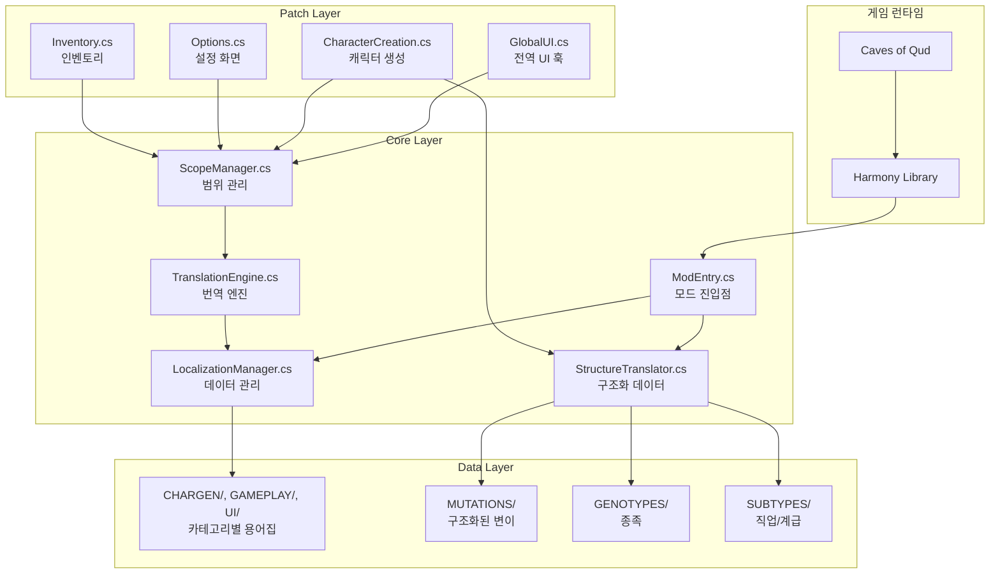

# 시스템 아키텍처

> 이 문서는 한글화 모드의 기술적 구조를 설명합니다.

---

## ⚠️ 패치 시 주의사항 (Critical Rules)

> **2026-01-19 추가**: ERR-008 사건에서 학습한 핵심 규칙

### 데이터 필드 vs UI 표시 분리 원칙

```
❌ 잘못된 패턴: 데이터 필드 직접 번역
   attr.Attribute = "힘";  // 게임이 Substring(0,3)으로 가공 → 크래시!

✅ 올바른 패턴: UI 표시 시점에 Postfix 패치
   [HarmonyPostfix]
   void Updated_Postfix(AttributeSelectionControl __instance) {
       __instance.attribute.text = "힘";  // UI 텍스트만 변경
   }
```

### 위험 필드 목록 (번역 금지)

| 클래스 | 필드 | 가공 방식 | 안전한 패치 지점 |
|--------|------|----------|-----------------|
| `AttributeDataElement` | `Attribute` | `Substring(0,3)` | `AttributeSelectionControl.Updated()` |
| `ChoiceWithColorIcon` | `Id` | 선택 로직 비교 | `Title`만 번역, `Id` 절대 변경 금지 |

### 동적 생성 텍스트 처리

평판 등 런타임에 조합되는 텍스트는 JSON에 정의할 수 없으므로 Regex 패턴 매칭 사용:

```csharp
// ChargenTranslationUtils.TranslateLongDescription()
var repMatch = Regex.Match(text, @"^([+-]?\d+)\s+reputation with\s+(.+)$");
if (repMatch.Success) {
    // 팩션명만 번역하고 포맷 재조합
}
```

---

## 시스템 구조도



---

## 컴포넌트 역할

### Core Layer

| 컴포넌트 | 파일 | 역할 |
|----------|------|------|
| **ModEntry** | `00_00_00_ModEntry.cs` | 모드 로드 시 초기화, Harmony 패치 실행 |
| **TranslationEngine** | `00_00_01_TranslationEngine.cs` | 태그 보존/복원, 대소문자 무시 번역 |
| **ScopeManager** | `00_00_02_ScopeManager.cs` | 화면별 번역 스코프 스택 관리 |
| **LocalizationManager** | `00_00_03_LocalizationManager.cs` | JSON 로드, 카테고리별 검색 |
| **StructureTranslator** | `99_00_03_StructureTranslator.cs` | MUTATIONS/GENOTYPES/SUBTYPES 처리 |
| **QudKREngine** | `00_00_99_QudKREngine.cs` | 한국어 폰트, 조사(은/는, 이/가) 처리 |

### Patch Layer

| 컴포넌트 | 대상 | 패치 방식 |
|----------|------|-----------|
| **GlobalUI** | TMP_Text, ScreenBuffer | Postfix - 모든 텍스트 번역 |
| **CharacterCreation** | 캐릭터 생성 12개 모듈 | Prefix/Postfix - 스코프 관리 |
| **Options** | 설정 화면 | 데이터 + UI 이중 패치 |
| **Inventory** | 인벤토리 | Postfix - 필터바, 카테고리 |

### Data Layer

| 유형 | 경로 | 담당 컴포넌트 |
|------|------|---------------|
| **Layer 1** | `CHARGEN/*.json`, `GAMEPLAY/*.json`, `UI/*.json` | LocalizationManager |
| **Layer 2** | `CHARGEN/GENOTYPES/`, `CHARGEN/SUBTYPES/`, `GAMEPLAY/MUTATIONS/` | StructureTranslator |

---

## 번역 파이프라인

```
원본 텍스트: "{{C|20}} bonus skill points each level"
    ↓
1. Trim (공백 제거)
    ↓
2. 색상 태그 정규화: {{C|...}} → {{c|...}}
    ↓
3. 접두사 추출 (체크박스 ☐, bullet ù 등) → 보관
    ↓
4. 색상 태그 제거: "20 bonus skill points each level"
    ↓
5. 사전 검색 (대소문자 변형 시도)
    - 원본 → UPPER → Title → lower
    ↓
6. 번역 발견: "레벨당 {{c|20}}의 보너스 기술 포인트"
    ↓
7. 태그 복원 (자동)
    ↓
8. 접두사 복원
    ↓
최종 결과: "{{c|20}} 레벨당 20의 보너스 기술 포인트"
```

### 태그 복원 메커니즘

```csharp
// TranslationEngine.RestoreColorTags()
// 원본에서 태그를 추출하여 번역문에 자동 복원

// 단, 태그가 단어 중간에 끼어 있으면 복원 실패 가능
// 예: "{{C|2}}0 bonus" → "2" + "0"으로 분리됨
// 이 경우 번역문 그대로 반환 (폴백)
```

---

## 스코프 스택 구조

```
┌─────────────────────────────────────────────┐
│ Stack[2]: 팝업 메뉴 (UI/common)             │ ← 현재 (최우선 검색)
├─────────────────────────────────────────────┤
│ Stack[1]: 캐릭터 생성 (CHARGEN/*.json)      │
├─────────────────────────────────────────────┤
│ Stack[0]: 전역 (UI/common, UI/terms)        │ ← 베이스
└─────────────────────────────────────────────┘
```

### 스코프 관리 API

```csharp
// 화면 진입 시
ScopeManager.PushScope(LocalizationManager.GetCategory("chargen*"));

// 화면 종료 시
ScopeManager.PopScope();

// 번역 시 (자동으로 스택 순서대로 검색)
TranslationEngine.TryTranslate(text, out translated);
```

### 스코프 Push/Pop 균형 규칙

```csharp
// ✅ 올바른 패턴
[HarmonyPrefix]
static void Show_Prefix() {
    ScopeManager.PushScope(...);
    _scopePushed = true;
}

[HarmonyPostfix]
static void Hide_Postfix() {
    if (_scopePushed) {
        ScopeManager.PopScope();
        _scopePushed = false;
    }
}

// ❌ 잘못된 패턴: Pop 없이 Push만 → 스택 누적
```

---

## 프로젝트 폴더 구조

```
qud_korean/
├── CONTEXT.yaml              # 현재 상태 (기계 판독용)
├── Scripts/                  # C# 모드 코드
│   ├── 00_Core/              # 핵심 엔진 (8개)
│   │   ├── 00_00_00_ModEntry.cs
│   │   ├── 00_00_01_TranslationEngine.cs
│   │   ├── 00_00_02_ScopeManager.cs
│   │   ├── 00_00_03_LocalizationManager.cs
│   │   └── 00_00_99_QudKREngine.cs
│   ├── 02_Patches/           # Harmony 패치 (11개)
│   │   ├── 00_Core/          # 플랫폼 패치
│   │   └── 10_UI/            # UI 패치
│   └── 99_Utils/             # 유틸리티 (3개)
│       ├── 99_00_01_TranslationUtils.cs
│       ├── 99_00_02_ChargenTranslationUtils.cs
│       └── 99_00_03_StructureTranslator.cs
├── LOCALIZATION/             # 번역 데이터
│   ├── README.md             # 구조 가이드
│   ├── CHARGEN/              # 캐릭터 생성 (Layer 1 + 2)
│   │   ├── *.json            # 모드, 스탯, UI 등
│   │   ├── GENOTYPES/        # 종족 (Layer 2)
│   │   └── SUBTYPES/         # 직업/계급 (Layer 2)
│   ├── GAMEPLAY/             # 게임플레이 (Layer 1 + 2)
│   │   ├── *.json            # 스킬, 사이버네틱스
│   │   └── MUTATIONS/        # 변이 (Layer 2)
│   ├── UI/                   # 사용자 인터페이스 (Layer 1)
│   │   └── *.json            # 공통 UI, 옵션, 용어
│   └── _DEPRECATED/          # 구버전 파일 보관
├── tools/                    # 개발 도구 (20개)
├── Docs/                     # 가이드 문서
├── Assets/                   # 게임 에셋 참조
│   ├── core_source/          # 디컴파일 소스
│   └── StreamingAssets/      # 게임 XML
└── _Legacy/                  # 레거시 보관
```

---

## 화면-에셋 맵핑

| 게임 화면 | XRL.UI 클래스 | Qud.UI 클래스 | XML 데이터 |
|-----------|---------------|---------------|------------|
| **메인 메뉴** | - | `MainMenu.cs` | - |
| **캐릭터 생성** | - | `XRL.CharacterBuilds.Qud.UI/*` | `EmbarkModules.xml` |
| **인벤토리** | `InventoryScreen.cs` | `InventoryAndEquipmentStatusScreen.cs` | `ObjectBlueprints/` |
| **설정** | `Options.cs` | `OptionsScreen.cs` | `Options.xml` |
| **거래** | `TradeUI.cs` | `TradeScreen.cs` | - |
| **대화** | `ConversationUI.cs` | - | `Conversations.xml` |

> ⚠️ **이중 구현 주의**: 대부분의 화면이 XRL.UI와 Qud.UI 양쪽에 존재. 실제 사용되는 클래스 확인 필수!

---

## 관련 문서

- [PRINCIPLES.md](00_PRINCIPLES.md) - 개발 대원칙
- [LOCALIZATION/README.md](../LOCALIZATION/README.md) - 데이터 구조 상세
- [WORKFLOW.md](05_WORKFLOW.md) - 작업 흐름 (예정)
