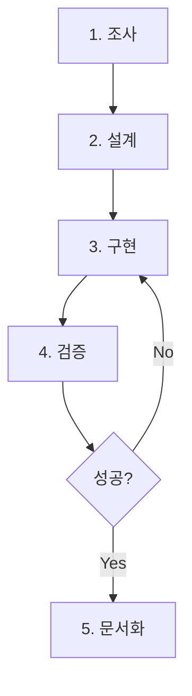
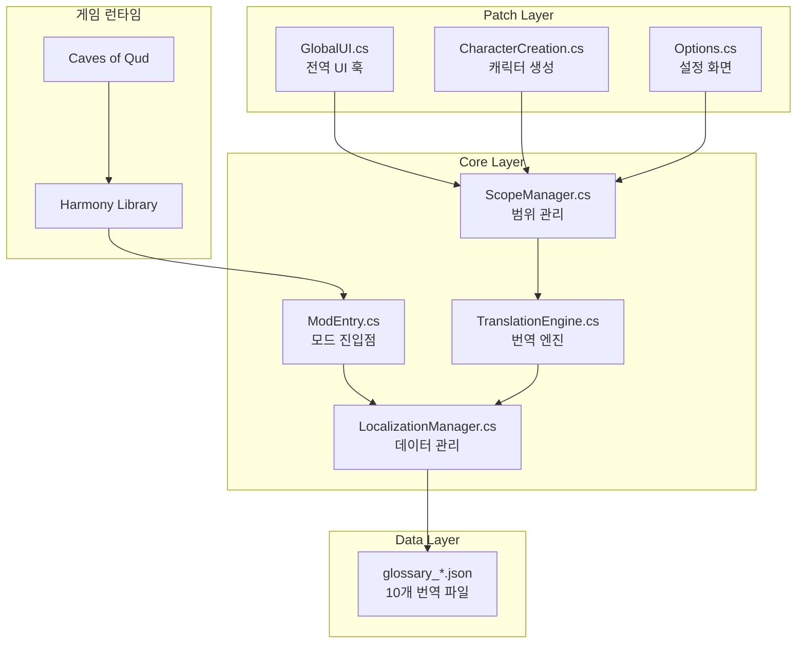
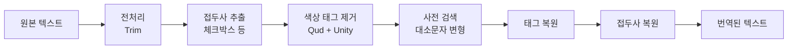
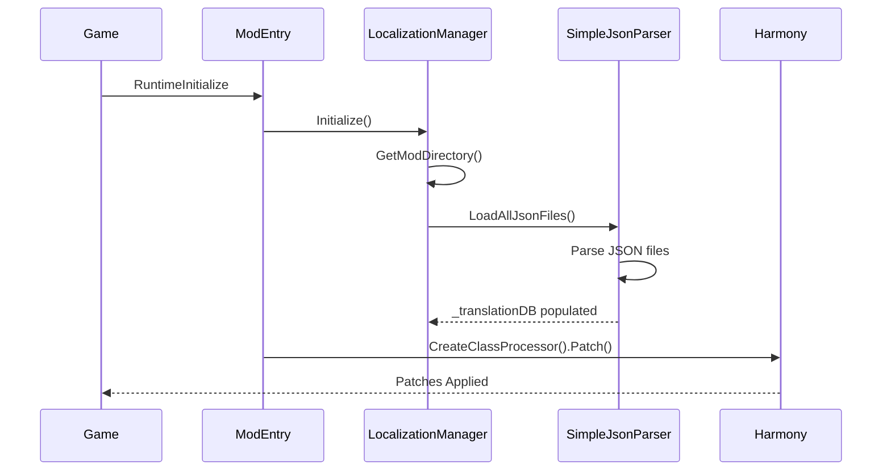
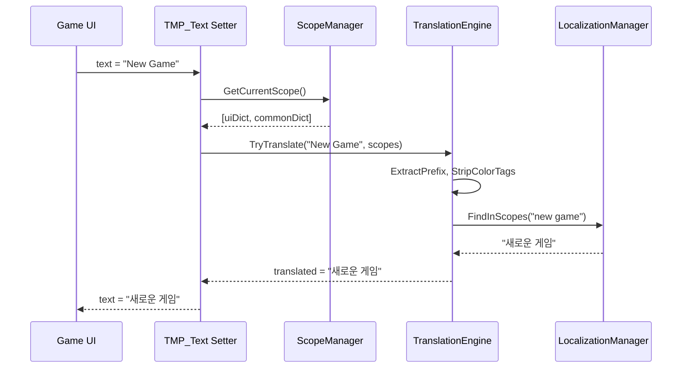
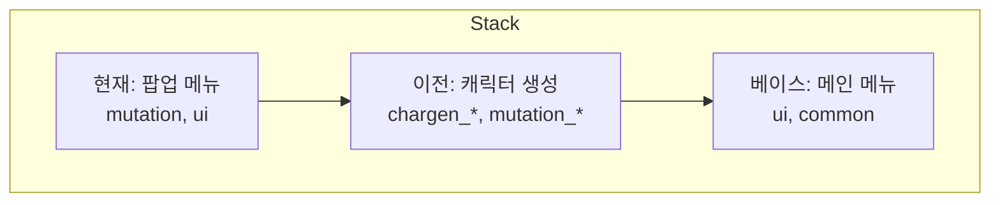
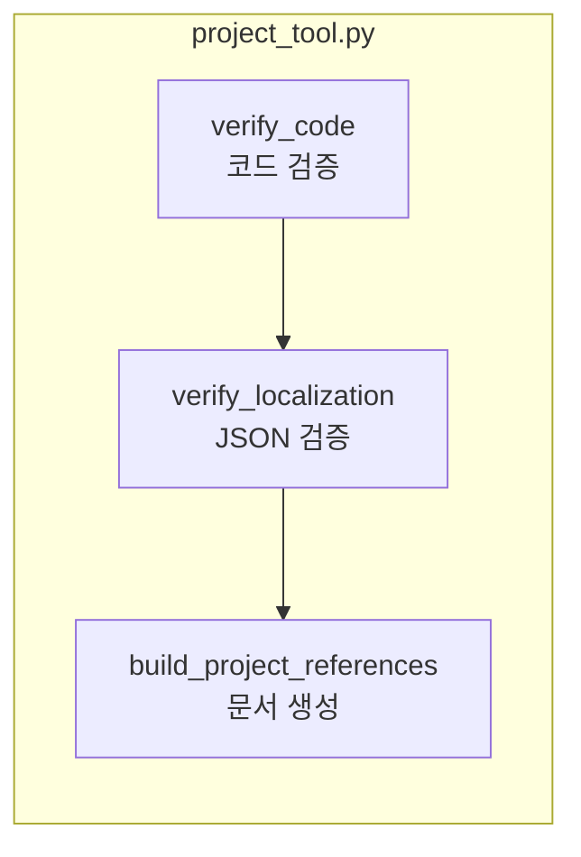

# Caves of Qud 한글화 프로젝트 - 개발 가이드

> **문서 버전**: 2.0 | **최종 업데이트**: 2026-01-16
> 
> 이 문서는 AI 에이전트와 개발자가 한글화 작업 시 **즉시 참고할 수 있는 실용적 가이드**입니다.

---

## 📌 문서 구조 (중요도순)

| 파트 | 섹션 | 대상 | 용도 |
|------|------|------|------|
| **A. 즉시 참조** | 1-3 | AI 에이전트, 개발자 | 작업 시작 전 필수 확인 |
| **B. 작업 가이드** | 4-6 | AI 에이전트 | 새 화면 번역 시 절차 |
| **C. 시스템 이해** | 7-9 | 개발자 | 아키텍처 및 코드 분석 |
| **D. 로드맵/부록** | 10-12 | PM, 개발자 | 계획 및 참조 자료 |

---

# Part A: 즉시 참조 (Quick Reference)

## 1. 빠른 시작 체크리스트

### 1.1 새 화면 번역 전 필수 확인

```markdown
□ 1. 대상 화면의 클래스 위치 확인
   - XRL.UI/ (레거시)와 Qud.UI/ (신규) 양쪽 검색
   
□ 2. 텍스트 출처 확인
   - C# 하드코딩 vs XML 데이터 vs 동적 생성
   
□ 3. 메서드 시그니처 검증
   - 추측 금지! 반드시 core_source에서 확인
   
□ 4. 기존 패치/용어집 중복 확인
   - glossary_*.json, 기존 패치 파일 검색
```

### 1.2 핵심 명령어 (복사해서 사용)

```bash
# 클래스 위치 찾기
grep -r "class ClassName" Assets/core_source/

# 메서드 시그니처 확인
grep -A 5 "public void MethodName" Assets/core_source/_GameSource/XRL.UI/FileName.cs

# 텍스트 출처 확인 (C# + XML 동시 검색)
grep -ri "exact text" Assets/core_source/ Assets/StreamingAssets/Base/

# 프로젝트 검증
python3 tools/project_tool.py

# 모드 배포
./tools/sync-and-deploy.sh
```

### 1.3 핵심 파일 경로

| 용도 | 경로 |
|------|------|
| 번역 엔진 | `Scripts/00_Core/00_00_01_TranslationEngine.cs` |
| 데이터 관리 | `Scripts/00_Core/00_00_03_LocalizationManager.cs` |
| 전역 UI 패치 | `Scripts/02_Patches/10_UI/02_10_00_GlobalUI.cs` |
| 게임 소스 인덱스 | `Assets/core_source/core_source_index.md` (131KB) |
| 공통 UI 용어 | `LOCALIZATION/glossary_ui.json` |

---

## 2. 화면-에셋 맵핑 테이블

### 2.1 주요 화면별 소스 위치

| 게임 화면 | XRL.UI 클래스 | Qud.UI 클래스 | XML 데이터 | 복잡도 |
|----------|--------------|--------------|-----------|--------|
| **메인 메뉴** | - | `MainMenu.cs` | - | 🟢 낮음 |
| **캐릭터 생성** | - | `XRL.CharacterBuilds.Qud.UI/*` | `EmbarkModules.xml`, `Genotypes.xml` | 🔴 높음 |
| **인벤토리** | `InventoryScreen.cs` (20KB) | `InventoryAndEquipmentStatusScreen.cs` | `ObjectBlueprints/` | 🔴 높음 |
| **설정** | `Options.cs` (37KB) | `OptionsScreen.cs` | `Options.xml` | 🟡 중간 |
| **거래** | `TradeUI.cs` (52KB) | `TradeScreen.cs` | - | 🔴 높음 |
| **대화** | `ConversationUI.cs` (15KB) | - | `Conversations.xml` (647KB) | 🔴 높음 |
| **팝업** | `Popup.cs` (82KB) | `PopupMessage.cs` | - | 🔴 높음 |
| **스킬** | `SkillsAndPowersScreen.cs` | `SkillsAndPowersStatusScreen.cs` | `Skills.xml` | 🟡 중간 |
| **상태창** | `StatusScreen.cs` (23KB) | `CharacterStatusScreen.cs` | - | 🟡 중간 |

> [!CAUTION]
> **이중 구현 주의**: 대부분의 화면이 XRL.UI와 Qud.UI 양쪽에 존재. 실제 사용되는 클래스 확인 필수!

### 2.2 XML 파일별 번역 대상 속성

| XML 파일 | 크기 | 주요 속성 |
|----------|------|----------|
| `Conversations.xml` | 647KB | `Text`, `Speaker`, `Choice` |
| `Skills.xml` | 53KB | `Name`, `Description`, `Category` |
| `Mutations.xml` | 17KB | `Name`, `Description` |
| `Options.xml` | 37KB | `DisplayText`, `HelpText`, `Values` |
| `ObjectBlueprints/*.xml` | ~5MB | `DisplayName`, `Description` |

---

## 3. AI 에이전트 실수 방지 가이드

### 3.1 절대 하지 말아야 할 것

| ❌ 금지 | ✅ 올바른 방법 |
|--------|---------------|
| 메서드 이름 추측 | `grep` 명령으로 실제 시그니처 확인 |
| XRL.UI만 확인 | XRL.UI + Qud.UI 양쪽 검색 |
| 텍스트 출처 가정 | C#/XML 전역 검색으로 확인 |
| 기존 코드 무시 | `project_tool.py`로 중복 확인 |
| 특수 태그 번역 | `%creature%`, `{{hotkey|...}}` 유지 |

### 3.2 흔한 실수 패턴

**실수 1: 존재하지 않는 메서드 패치**
```csharp
// ❌ 잘못됨 - UpdateDisplay 메서드가 없을 수 있음
[HarmonyPatch(typeof(InventoryScreen), "UpdateDisplay")]

// ✅ 올바름 - 먼저 확인
grep "void Update\|void Refresh\|void Show" Assets/core_source/_GameSource/XRL.UI/InventoryScreen.cs
```

**실수 2: 잘못된 네임스페이스 패치**
```csharp
// ❌ 잘못됨 - 실제로 Qud.UI.OptionsScreen이 사용될 수 있음
[HarmonyPatch(typeof(XRL.UI.Options), "Show")]

// ✅ 올바름 - 양쪽 모두 확인
ls Assets/core_source/_GameSource/XRL.UI/ | grep -i options
ls Assets/core_source/_GameSource/Qud.UI/ | grep -i options
```

**실수 3: 특수 태그 깨뜨림**
```json
// ❌ 잘못됨 - 플레이스홀더 번역함
{"{{W|&Y%creature%&W}} attacks you!": "{{W|&Y적&W}}이 당신을 공격합니다!"}

// ✅ 올바름 - 플레이스홀더 유지
{"{{W|&Y%creature%&W}} attacks you!": "{{W|&Y%creature%&W}}{이/가} 당신을 공격합니다!"}
```

---

# Part B: 작업 가이드 (Work Procedures)

## 4. 새 화면 번역 표준 절차

### 4.1 단계별 작업 흐름



### 4.2 Step 1: 조사 (Investigation)

**필수 확인 항목:**

```bash
# 1. 클래스 위치 확인
grep -r "class ScreenName" Assets/core_source/

# 2. XRL.UI와 Qud.UI 양쪽 확인
ls Assets/core_source/_GameSource/XRL.UI/ | grep -i screen
ls Assets/core_source/_GameSource/Qud.UI/ | grep -i screen

# 3. 텍스트 출처 확인
grep -ri "버튼 텍스트" Assets/core_source/ Assets/StreamingAssets/Base/

# 4. 기존 패치 확인
grep -r "ScreenName" Scripts/02_Patches/
```

**조사 결과 기록 템플릿:**

```markdown
## 화면: [화면명]

### 소스 파일
- XRL.UI: `[파일명]` ([크기])
- Qud.UI: `[파일명]` ([크기])

### 데이터 소스
- XML: `[파일명]` - 속성: `[Name, Description 등]`
- 하드코딩: `[파일:라인번호]`

### 패치 대상 메서드 (검증됨)
| 클래스 | 메서드 | 시그니처 |
|--------|--------|----------|
| | | |

### 예상 번역 항목
- JSON: `glossary_xxx.json`
- 항목 수: ~N개
```

### 4.3 Step 2: 설계 및 Step 3: 구현

**패치 코드 템플릿:**

```csharp
/*
 * 파일명: 02_10_XX_NewScreen.cs
 * 분류: [UI Patch] 새 화면 번역
 * 역할: {화면명} UI 텍스트 번역
 */

using HarmonyLib;
using QudKRTranslation.Core;

namespace QudKRTranslation.Patches
{
    [HarmonyPatch(typeof(TargetClass))]
    public static class Patch_NewScreen
    {
        private static bool _scopePushed = false;

        [HarmonyPatch(nameof(TargetClass.Show))]
        [HarmonyPrefix]
        static void Show_Prefix()
        {
            if (!_scopePushed)
            {
                var dict = LocalizationManager.GetCategory("category_name");
                if (dict != null)
                {
                    ScopeManager.PushScope(dict);
                    _scopePushed = true;
                }
            }
        }

        [HarmonyPatch(nameof(TargetClass.Hide))]
        [HarmonyPostfix]
        static void Hide_Postfix()
        {
            if (_scopePushed)
            {
                ScopeManager.PopScope();
                _scopePushed = false;
            }
        }
    }
}
```

**용어집 항목 규칙:**
- 키는 **항상 소문자**
- 설명 카테고리는 `_desc` 접미사
- 색상 태그 포함 가능

### 4.4 Step 4: 검증

```bash
# 1. 코드 검증
python3 tools/project_tool.py

# 2. 배포
./tools/sync-and-deploy.sh

# 3. 게임 로그 확인
tail -f ~/Library/Logs/Caves\ of\ Qud/Player.log | grep "Qud-KR"
```

**성공 기준:**
- [ ] 패치 성공 로그 확인
- [ ] 대상 화면 텍스트 한글 표시
- [ ] 기존 기능 정상 동작
- [ ] 스코프 Push/Pop 균형

---

## 5. AI 에이전트 작업 요청 방법

### 5.1 효과적인 요청 템플릿

```markdown
## 작업 유형
[번역 추가 / 패치 구현 / 버그 수정 / 도구 개발]

## 대상
- 화면/기능: [설명]
- 파일: [경로]

## 현재 상태
- 증상: [문제]
- 로그: [에러 메시지]

## 원하는 결과
- [구체적 기대 동작]

## 검증 방법
- [테스트 방법]
```

### 5.2 요청 유형별 예시

**번역 추가:**
```
## 작업 유형: 번역 추가
## 대상: LOCALIZATION/glossary_ui.json의 inventory 카테고리
## 현재 상태: "Floating Nearby" 텍스트 미번역
## 원하는 결과: "주변 부유" 번역 추가
```

**패치 구현:**
```
## 작업 유형: 패치 구현
## 대상: 거래 화면 (Trade Screen)
## 현재 상태: "Trade", "Buy", "Sell" 버튼 영문
## 원하는 결과: 거래 UI 한글화
## 필요 정보: 대상 클래스 확인 필요
```

### 5.3 AI에게 제공해야 할 컨텍스트

1. **현재 파일 상태**: `cat Scripts/02_Patches/.../file.cs`
2. **게임 소스**: `grep -A 20 "class ClassName" Assets/core_source/...`
3. **에러 로그**: `tail -100 ~/Library/Logs/.../Player.log | grep "Qud-KR"`
4. **현재 용어집**: `cat LOCALIZATION/glossary_xxx.json | jq '.category'`

---

## 6. 알려진 이슈 및 Edge Cases

### 6.1 현재 미해결 이슈

| ID | 이슈 | 심각도 | 상태 |
|----|------|--------|------|
| I-01 | 인벤토리 "*All" 필터 미번역 | 🔴 높음 | 미해결 |
| I-02 | 조사 처리 시 색상 태그 내부 한글 인식 안됨 | 🟡 중간 | 미해결 |
| I-03 | Options 빈 값 ~50개 | 🟡 중간 | 미해결 |
| I-04 | 변이 설명 5개 누락 | 🟢 낮음 | 미해결 |

### 6.2 복잡한 패치 구조

**Options.cs - 이중 레이어 패치:**
- 데이터 레이어: `LoadOptionNode`, `LoadAllOptions`
- UI 레이어: `OptionsScreen.Show`, `FilterItems`
- 스코프 누수 가능성 → Finalizer로 완화

**Inventory.cs - 필터 바 미완성:**
```csharp
// TODO: FilterBar 컴포넌트 접근 필요
// "*All" → "전체" 변환 미구현
```

### 6.3 특수 텍스트 처리

| 패턴 | 예시 | 처리 방법 |
|------|------|----------|
| 변수 플레이스홀더 | `%creature%` | 그대로 유지 |
| 핫키 참조 | `{{hotkey|ability:Sprint}}` | 그대로 유지 |
| 조건부 태그 | `[if:HasPart:Wings]You fly.[/if]` | 그대로 유지 |
| 색상 태그 | `{{w|text}}` | 태그 유지, 내부만 번역 |

---

# Part C: 시스템 이해 (Architecture)

## 7. 아키텍처 개요

### 7.1 시스템 구조도



### 7.2 핵심 설계 원칙

| 원칙 | 설명 | 구현 |
|------|------|------|
| **Harmony 패칭** | 비침습적 수정 | `[HarmonyPatch]` 어트리뷰트 |
| **스코프 기반 번역** | 화면별 문맥 인식 | `ScopeManager` Stack |
| **태그 보존** | 마크업 유지 | `TranslationEngine.RestoreColorTags()` |
| **카테고리 기반 용어** | 체계적 관리 | `glossary_*.json` 분리 |

---

## 8. 핵심 컴포넌트 분석

### 8.1 TranslationEngine.cs (163 lines)

**번역 파이프라인:**
```
원본 → Trim → 접두사 추출 → 태그 제거 → 사전 검색 → 태그 복원 → 번역됨
```

**대소문자 검색 순서:**
1. 원본 그대로
2. 전체 대문자 (`EXAMPLE`)
3. Title Case (`Example`)
4. 전체 소문자 (`example`)

### 8.2 LocalizationManager.cs (249 lines)

**주요 API:**
| 메서드 | 용도 |
|--------|------|
| `GetCategory(string)` | 단일 카테고리 반환 |
| `GetCategoryGroup(string prefix)` | `prefix_*` 모두 병합 |
| `TryGetAnyTerm(key, out result, params cats)` | 다중 카테고리 검색 |

### 8.3 ScopeManager.cs (102 lines)

**스택 구조:**
```
[현재: 팝업 메뉴] → [이전: 캐릭터 생성] → [베이스: 메인 메뉴]
```

### 8.4 QudKREngine.cs (169 lines)

**한국어 조사 처리:**
```csharp
// {을/를}, {이/가}, {은/는}, {와/과}, {으로/로}
ProcessPattern(sb, "{을/를}", "을", "를");  // 받침 있으면 "을"
```

**영문법 무력화:**
- 관사(a/an/the) 제거
- 복수형(-s) 제거

---

## 9. 데이터 구조

### 9.1 프로젝트 폴더 구조

```
qud_korean/
├── Scripts/              # C# 모드 코드 (21개 파일)
│   ├── 00_Core/          # 핵심 엔진 (8개)
│   ├── 02_Patches/       # Harmony 패치 (11개)
│   └── 99_Utils/         # 유틸리티 (2개)
├── LOCALIZATION/         # 번역 데이터 (10개 JSON, ~1,500항목)
├── Assets/               # 게임 에셋 참조
│   ├── core_source/      # 디컴파일 소스
│   └── StreamingAssets/  # 게임 XML
├── tools/                # 개발 도구 (14개)
└── Docs/                 # 가이드 문서 (11개)
```

### 9.2 용어집 구조

| 파일 | 항목 수 | 완성도 |
|------|---------|--------|
| glossary_ui.json | 168 | 100% |
| glossary_chargen.json | 127 | 100% |
| glossary_skills.json | 183 | 100% |
| glossary_mutations.json | 143 | 96.5% |
| glossary_options.json | ~800 | 94% |

### 9.3 네임스페이스 구조

| 네임스페이스 | 파일 수 | 용도 |
|-------------|---------|------|
| `XRL.UI` | 110 | 레거시 UI (큰 파일들) |
| `Qud.UI` | 174 | 신규 UI 컴포넌트 |
| `XRL.CharacterBuilds.Qud.UI` | ~20 | 캐릭터 생성 |
| `XRL.World.Parts.Mutation` | ~50 | 변이 |
| `XRL.World.Parts.Skill` | ~30 | 스킬 |

---

# Part D: 로드맵 및 부록 (Roadmap & Appendix)

## 10. 개발 로드맵

### 10.1 Phase 1: 안정화 (2주)

| ID | 작업 | 우선순위 | 완료 기준 |
|----|------|----------|----------|
| P1-01 | 인벤토리 "*All" 번역 | 🔴 | 필터 바 "전체" 표시 |
| P1-02 | Options 빈 값 50개 번역 | 🟡 | `project_tool.py` 빈 값 0 |
| P1-03 | 조사 태그 내부 지원 | 🟡 | `{{w|검}}{을/를}` → `{{w|검}}을` |
| P1-04 | 변이 5개 누락 번역 | 🟢 | mutations JSON 완성 |

### 10.2 Phase 2: 게임플레이 (2~4주)

| ID | 작업 | 예상 시간 | 필요 사항 |
|----|------|----------|----------|
| P2-01 | 메시지 로그 패치 | 8h | XRL.Messages 분석 |
| P2-02 | 아이템 추출 스크립트 | 4h | ObjectBlueprints 파싱 |
| P2-03 | 아이템 번역 (500+) | 20h | glossary_items.json 생성 |
| P2-04 | NPC 대화 추출 | 16h | Conversations.xml 파싱 |

### 10.3 Phase 3: 최적화 (4~6주)

- 번역 캐싱 구현
- 누락 용어 자동 수집
- 성능 프로파일링

### 10.4 Phase 4: 커뮤니티 (6주+)

- 웹 기반 번역 에디터
- Steam Workshop 자동 배포
- 버전 호환성 자동 검증

---

## 11. 현재 상태 요약

### 11.1 번역 커버리지

| 영역 | 상태 | 커버리지 |
|------|------|----------|
| 메인 메뉴 | ✅ 완료 | 95%+ |
| 캐릭터 생성 | ✅ 완료 | 90%+ |
| 설정 화면 | ✅ 완료 | 85%+ |
| 인벤토리 | 🔄 진행 중 | 60%+ |
| 게임플레이 | ⏳ 예정 | 20%+ |

### 11.2 기술적 리스크

| 리스크 | 심각도 | 완화 방안 |
|--------|--------|----------|
| 게임 업데이트 호환성 | 🔴 | `VerifyPatchTargets()` |
| TMP_Text 전역 패치 성능 | 🟡 | 조건부 실행 최적화 |
| Traverse 리플렉션 오버헤드 | 🟡 | 캐싱 도입 |

---

## 12. 부록

### 12.1 디버깅 체크리스트

- [ ] `python3 tools/project_tool.py` 검증 통과?
- [ ] 게임 로그에 "패치 성공" 메시지?
- [ ] JSON 문법 오류 없음?
- [ ] 스코프 Push/Pop 균형?

### 12.2 자주 사용하는 도구

| 도구 | 용도 |
|------|------|
| `project_tool.py` | 코드/JSON 검증, 메타데이터 생성 |
| `check_missing_translations.py` | XML/C# 미번역 탐색 |
| `deploy-mods.sh` | 게임 폴더로 배포 |
| `validate-mod.sh` | 모드 무결성 검증 |

### 12.3 게임 업데이트 대응

| 변경 유형 | 자동 감지 | 대응 |
|-----------|----------|------|
| 메서드 이름 변경 | ✅ | 패치 코드 수정 |
| 파라미터 변경 | ❌ | 수동 검증 |
| 새 UI 화면 추가 | ❌ | 새 패치 추가 |
| 내부 필드 변경 | ❌ | 필드명 업데이트 |

---

# Part E: 상세 부록 (Detailed Appendices)

## 부록 A: 핵심 컴포넌트 상세 코드 분석

### A.1 TranslationEngine.cs 상세 (163 lines)

**번역 파이프라인 상세:**


**지원 접두사:**
```csharp
string[] prefixes = { 
    "[■] ", "[ ] ", "[*] ", "[X] ", "[x] ", 
    "[Space] ", "[-] ", "[+] ", 
    "( ) ", "(X) ", "(x) ", "(*) ", "(-) ", "(+) " 
};
```

**핵심 메서드:**
```csharp
public static bool TryTranslate(string text, out string translated, Dictionary<string, string>[] scopes)
{
    // 1. 전처리
    text = text.Trim();
    
    // 2. 접두사 추출
    string prefix = ExtractPrefix(ref text);
    
    // 3. 색상 태그 제거
    string stripped = StripColorTags(text);
    
    // 4. 대소문자 변형 검색
    // Original → UPPER → Title → lower
    
    // 5. 태그 복원
    translated = RestoreColorTags(text, stripped, result);
    
    // 6. 접두사 복원
    translated = prefix + translated;
}
```

### A.2 LocalizationManager.cs 상세 (249 lines)

**데이터 구조:**
```csharp
Dictionary<string, Dictionary<string, string>> _translationDB
// 예: {"ui": {"new game": "새로운 게임"}, "chargen_mode": {...}}
```

**서브카테고리 자동 병합:**
```csharp
// "chargen"으로 호출하면 chargen_mode, chargen_ui, chargen_stats 자동 병합
var chargen = LocalizationManager.GetCategory("chargen*");
```

**SimpleJsonParser:**
- 내장 경량 JSON 파서 (외부 의존성 없음)
- `LOCALIZATION/` 폴더의 모든 `.json` 자동 로드
- 지원: `{ "category": { "key": "value" } }`
- 미지원: 중첩 객체, 배열, 숫자 타입

### A.3 QudKREngine.cs 상세 (169 lines)

**한국어 조사 처리 로직:**
```csharp
public static bool HasJongsung(char c)
{
    if (c < 0xAC00 || c > 0xD7A3) return false;
    return (c - 0xAC00) % 28 != 0;  // 유니코드 한글 계산
}

private static void ProcessPattern(StringBuilder sb, string pattern, string josaWith, string josaWithout)
{
    // {을/를} → 받침 있으면 "을", 없으면 "를"
}
```

**영문법 무력화 패치:**
```csharp
// 관사(a/an/the) 제거
[HarmonyPatch(typeof(Grammar), "IndefiniteArticle")]
static bool Prefix(ref string __result) { __result = ""; return false; }

// 복수형(-s) 제거
[HarmonyPatch(typeof(Grammar), "Pluralize")]
static bool Prefix(string word, ref string __result) { __result = word; return false; }
```

---

## 부록 B: 데이터 흐름 다이어그램

### B.1 초기화 흐름



### B.2 번역 흐름



### B.3 스코프 스택 구조



---

## 부록 C: 전체 파일 목록

### C.1 Core 스크립트 (8개)

| 파일 | 라인 | 역할 |
|------|------|------|
| [00_00_00_ModEntry.cs](file:///Users/ben/Desktop/qud_korean/Scripts/00_Core/00_00_00_ModEntry.cs) | 95 | 모드 진입점 |
| [00_00_01_TranslationEngine.cs](file:///Users/ben/Desktop/qud_korean/Scripts/00_Core/00_00_01_TranslationEngine.cs) | 163 | 번역 엔진 |
| [00_00_02_ScopeManager.cs](file:///Users/ben/Desktop/qud_korean/Scripts/00_Core/00_00_02_ScopeManager.cs) | 102 | 범위 관리 |
| [00_00_03_LocalizationManager.cs](file:///Users/ben/Desktop/qud_korean/Scripts/00_Core/00_00_03_LocalizationManager.cs) | 249 | 데이터 관리 |
| [00_00_04_GlossaryLoader.cs](file:///Users/ben/Desktop/qud_korean/Scripts/00_Core/00_00_04_GlossaryLoader.cs) | ~25 | 용어집 로더 |
| [00_00_05_GlossaryExtensions.cs](file:///Users/ben/Desktop/qud_korean/Scripts/00_Core/00_00_05_GlossaryExtensions.cs) | ~35 | 용어집 확장 |
| [00_00_06_G.cs](file:///Users/ben/Desktop/qud_korean/Scripts/00_Core/00_00_06_G.cs) | 55 | 글로벌 접근자 |
| [00_00_99_QudKREngine.cs](file:///Users/ben/Desktop/qud_korean/Scripts/00_Core/00_00_99_QudKREngine.cs) | 169 | 엔진 확장 |

### C.2 Patch 스크립트 (11개)

| 파일 | 라인 | 역할 |
|------|------|------|
| [02_10_00_GlobalUI.cs](file:///Users/ben/Desktop/qud_korean/Scripts/02_Patches/10_UI/02_10_00_GlobalUI.cs) | 388 | 전역 UI, TMP_Text 훅 |
| [02_10_01_Options.cs](file:///Users/ben/Desktop/qud_korean/Scripts/02_Patches/10_UI/02_10_01_Options.cs) | 231 | 설정 화면 |
| [02_10_02_Tooltip.cs](file:///Users/ben/Desktop/qud_korean/Scripts/02_Patches/10_UI/02_10_02_Tooltip.cs) | ~25 | 툴팁 |
| [02_10_03_UITextSkin.cs](file:///Users/ben/Desktop/qud_korean/Scripts/02_Patches/10_UI/02_10_03_UITextSkin.cs) | ~30 | 텍스트 스킨 |
| [02_10_04_ListScroller.cs](file:///Users/ben/Desktop/qud_korean/Scripts/02_Patches/10_UI/02_10_04_ListScroller.cs) | ~120 | 리스트 스크롤러 |
| [02_10_07_Inventory.cs](file:///Users/ben/Desktop/qud_korean/Scripts/02_Patches/10_UI/02_10_07_Inventory.cs) | 96 | 인벤토리 |
| [02_10_08_Status.cs](file:///Users/ben/Desktop/qud_korean/Scripts/02_Patches/10_UI/02_10_08_Status.cs) | ~60 | 상태 화면 |
| [02_10_10_CharacterCreation.cs](file:///Users/ben/Desktop/qud_korean/Scripts/02_Patches/10_UI/02_10_10_CharacterCreation.cs) | 490 | 캐릭터 생성 (12개 모듈) |
| [02_10_15_EmbarkOverlay.cs](file:///Users/ben/Desktop/qud_korean/Scripts/02_Patches/10_UI/02_10_15_EmbarkOverlay.cs) | ~30 | 출발 오버레이 |
| [02_00_01_SteamGalaxy.cs](file:///Users/ben/Desktop/qud_korean/Scripts/02_Patches/00_Core/02_00_01_SteamGalaxy.cs) | ~60 | Steam/Galaxy 연동 |
| [02_00_02_ScreenBuffer.cs](file:///Users/ben/Desktop/qud_korean/Scripts/02_Patches/00_Core/02_00_02_ScreenBuffer.cs) | ~55 | 화면 버퍼 |

### C.3 Utils 스크립트 (2개)

| 파일 | 라인 | 역할 |
|------|------|------|
| [99_00_01_TranslationUtils.cs](file:///Users/ben/Desktop/qud_korean/Scripts/99_Utils/99_00_01_TranslationUtils.cs) | 99 | 태그 보존 번역 |
| [99_00_02_ChargenTranslationUtils.cs](file:///Users/ben/Desktop/qud_korean/Scripts/99_Utils/99_00_02_ChargenTranslationUtils.cs) | 88 | 캐릭터 생성 유틸 |

### C.4 용어집 파일 (10개)

| 파일 | 카테고리 | 항목 수 | 용도 |
|------|----------|---------|------|
| `glossary_ui.json` | ui, common, inventory, status | ~170 | 공통 UI |
| `glossary_chargen.json` | chargen_mode, chargen_stats, chargen_ui | ~130 | 캐릭터 생성 |
| `glossary_mutations.json` | mutation, mutation_desc | ~150 | 변이 |
| `glossary_skills.json` | skill, skill_desc, power_* | ~280 | 스킬 |
| `glossary_cybernetics.json` | cybernetics, cybernetics_desc | ~190 | 사이버네틱스 |
| `glossary_options.json` | options, options_desc | ~800 | 설정 화면 |
| `glossary_pregen.json` | chargen_pregen | ~50 | 프리셋 캐릭터 |
| `glossary_proto.json` | chargen_proto | ~60 | 종족/유형 |
| `glossary_location.json` | chargen_location | ~50 | 시작 위치 |
| `glossary_terms.json` | terms | ~35 | 일반 용어 |

---

## 부록 D: 프로젝트 도구 상세

### D.1 project_tool.py (290 lines)

**핵심 기능:**


**1. verify_code() - 코드 검증**
- 함수/클래스 중복 탐지
- 중괄호 불일치 검사
- 표준 헤더 (`분류:`, `역할:`) 체크

**2. verify_localization() - JSON 검증**
- 빈 번역 값 탐지
- 카테고리 내 중복 키 검사
- JSON 파싱 오류 리포트

**3. build_project_references() - 문서 자동 생성**
- `01_CORE_PROJECT_INDEX.md`: 모든 메서드 시그니처
- `02_CORE_QUICK_REFERENCE.md`: 빠른 참조 가이드
- `project_metadata.json`: 머신 리더블 메타데이터

### D.2 전체 도구 목록

| 파일 | 유형 | 용도 |
|------|------|------|
| `project_tool.py` | Python | 통합 검증 및 메타데이터 생성 |
| `check_missing_translations.py` | Python | XML/C# 내 미번역 탐색 |
| `check_logs_for_untranslated.py` | Python | 게임 로그에서 미번역 추출 |
| `fix_json_duplicates.py` | Python | JSON 중복 키 수정 |
| `merge_options.py` | Python | 옵션 XML 추출 및 병합 |
| `extract_keys.py` | Python | 키 추출 |
| `sort_json.py` | Python | JSON 정렬 |
| `deploy-mods.sh` | Shell | 게임 모드 폴더로 배포 |
| `sync.sh` | Shell | Git 동기화 |
| `sync-and-deploy.sh` | Shell | 동기화 + 배포 |
| `validate-mod.sh` | Shell | 모드 무결성 검증 |
| `watch-and-sync.sh` | Shell | 파일 변경 감시 |
| `quick-save.sh` | Shell | 빠른 저장 |

---

## 부록 E: 캐릭터 생성 패치 상세

### E.1 패치 대상 화면 (12개 모듈)

| # | 클래스 | 화면 | 번역 항목 |
|---|--------|------|----------|
| 0 | `AbstractBuilderModuleWindowBase` | 공통 하단 메뉴/브레드크럼 | 버튼, 네비게이션 |
| 1 | `QudGamemodeModuleWindow` | 게임 모드 선택 | Classic, Roleplay 등 |
| 2 | `QudChartypeModuleWindow` | 캐릭터 유형 선택 | 유형 설명 |
| 3 | `QudGenotypeModuleWindow` | 종족 선택 | Mutant, True Kin |
| 4 | `QudSubtypeModule/Window` | 직업/계급 선택 | 직업별 설명 |
| 5 | `QudAttributesModuleWindow` | 속성 분배 | Strength, Agility 등 |
| 6 | `QudMutationsModuleWindow` | 변이 선택 | 변이명, 설명 |
| 7 | `QudCyberneticsModuleWindow` | 사이버네틱스 선택 | 사이버네틱스명, 설명 |
| 8 | `QudPregenModuleWindow` | 프리셋 선택 | 프리셋 캐릭터명 |
| 9 | `QudChooseStartingLocationModuleWindow` | 시작 위치 선택 | 위치명, 설명 |
| 10 | `QudCustomizeCharacterModuleWindow` | 커스터마이징 | 이름, 외형 |
| 11 | `QudBuildSummaryModuleWindow` | 빌드 요약 | 요약 텍스트 |
| 12 | `Patch_GenericBreadcrumbs` | 브레드크럼 통합 | 네비게이션 |

### E.2 Daily 모드 동적 날짜 처리

```csharp
// "Currently in day {{W|16}} of {{W|2026}}." → "현재 {{w|2026}}년 {{w|16}}일차."
if (choice.Id == "Daily" && desc.Contains("Currently in day"))
{
    var match = Regex.Match(desc, @"day {{W\|(\d+)}} of {{W\|(\d+)}}");
    if (match.Success)
    {
        string dayOfYear = match.Groups[1].Value;
        string year = match.Groups[2].Value;
        desc = $"현재 {{{{w|{year}}}}}년 {{{{w|{dayOfYear}}}}}일차.";
    }
}
```

---

## 부록 F: 품질 검증 스크립트 (권장 추가)

### F.1 번역 품질 자동 검사

```python
# tools/validate_translation_quality.py
def validate_translation_quality():
    """번역 품질 자동 검사"""
    issues = []
    
    for json_file in LOCALIZATION_DIR.glob("*.json"):
        data = json.load(open(json_file))
        for cat, terms in data.items():
            for en, ko in terms.items():
                # 1. 빈 번역
                if not ko.strip():
                    issues.append(f"[EMPTY] {cat}.{en}")
                
                # 2. 영문 그대로 복사
                if en.lower() == ko.lower():
                    issues.append(f"[COPY] {cat}.{en}")
                
                # 3. 태그 불일치
                en_tags = re.findall(r'\{\{[a-zA-Z]\|', en)
                ko_tags = re.findall(r'\{\{[a-zA-Z]\|', ko)
                if len(en_tags) != len(ko_tags):
                    issues.append(f"[TAG_MISMATCH] {cat}.{en}")
    
    return issues
```

---

## 부록 G: manifest.json 및 workshop.json

### G.1 manifest.json
```json
{
  "id": "KoreanLocalization",
  "title": "Korean Localization (한글화)",
  "version": "1.0.0",
  "author": "boram",
  "description": "Complete Korean (Hangul) localization for Caves of Qud.",
  "tags": ["Translation", "Localization", "Korean"],
  "preloadScripts": [
    "Scripts/QudKREngine.cs"
  ]
}
```

### G.2 workshop.json
```json
{
  "Title": "Korean Localization (한글화)",
  "Description": "Complete Korean localization for Caves of Qud...",
  "Tags": "Localization,Translation,Korean,Language",
  "Visibility": "Public",
  "PreviewFile": "preview.png"
}
```

---

*문서 버전 2.1 | 2026-01-16 | 상세 부록 추가*

